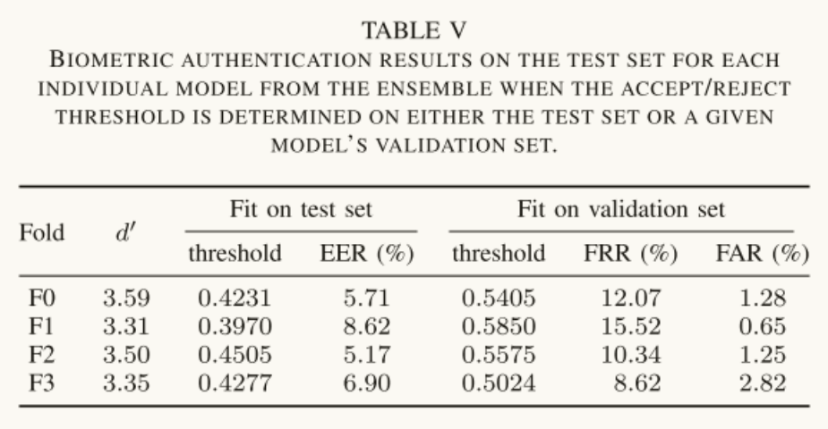

Paper Note

# Datasets

GazeBase: 参与者为 322 名大学生，每个参与者使用 EyeLink 1000 在 1000Hz 下记录左眼，记录 37 月的 9 轮实验

> github 链接： https://github.com/griffihk/GazeBaseCodeRepo

  
每一轮包含两个录制会话，中间间隔约 30 分钟。在每个录制会话中，参与者进行如下 7 个任务：随机扫视（RAN），水平扫视（HSS），固视（FXS），互动球弹游戏（BLG），阅读（TEX），以及两个视频观看任务（VD1 和 VD2）。如此得到 1 个 Round 的数据，共 9 个 Round。  
每一轮的参与者都是前一轮参与者的子集，从 R1 到 R9 呈现递减的状态，只有 14 个人(R9)参与了所有的 9 个 Round。  
该实验使用了训练集、验证集、测试集。在 R6 轮中有 59 个人，这 59 个人全部存在于 R1-R6 过程中，同时不完全存在于 R6-R9 过程中（有部分参与者离开）。每一轮都使用这些特殊的参与者的数据作为最后的测试集，剩下的 263 参与者的数据作为训练集和验证集。在每一轮中，将除去这 59 个人的数据 4 折，分为 F0~3，每一折的数据尽量平衡，这 4 折用于交叉验证——1 个作验证，其余 3 个作训练。  
特殊的，由于 BLG 任务的时间较长，所以只在测试集中保留这项数据（即只保留那 59 个人的），而在训练集和验证集中去除这项数据。以此来评估模型在非样本任务上的泛化能力。

# evaluation

  
baseline 是用 R1 中的 TEX 数据做验证，因为 R1 中的 TEX 数据是最多的，且 TEX 的应用场景最具代表性。

## A: 任务对认证精度的影响

替换 TEX 任务为其他任务，研究任务类型对识别精度的影响，需要注意的是他们在所有任务上评估的都是同一个集成模型，而不是为每个任务单独训练一个模型。

## B：特征老化对认证精度的影响

使用 R1 的第一个录制会话中的 TEX 任务的数据作为 enrollment 数据集，使用 R2~9 的第二个录制会话作为 authentication 数据集，以模拟经过了 37 个月的时间后系统能否准确识别身份。

## C：录制时长对认证精度的影响

将多个窗口的数据输入到模型中得到嵌入向量然后对这些嵌入向量进行平均，得到一个代表所有窗口的嵌入向量。

**ABC 三部分的结果图**


## D：采样率对认证精度的影响

通过使用 anti-aliasing filter(SciPy's decimate func)来降低采样率到 500 250 125 50 31.25Hz


## E：评估 FRR@FAR 0.0001

这是为了模拟一个 4 位数的 PIN 码提供的安全级别，因为 4 位数的 PIN 码假定所有的四位数组合被用户均等地选择，其 FAR 就是 0.0001


## F：在验证集而非测试集上决定阈值



## G：模拟实际头戴式显示器的空间噪声

添加高斯噪声，空间精度的降低对身份验证精度有显著影响


## H：已有工作的对比

1. 与 STAR、DEL 和 EKY 模型做对比
2. 将 EKYT 模型应用到双眼数据集 JuDo1000 上


## I：评估不同损失权重的效果

比较 Wms 和 Wce 的效果


## 测试结果

```shell
Creating held-out test set
Created test set with 18.32% of subjects, 49.26% of recordings
Assigning remaining subjects to folds
Max - min of # subjects in each fold: 1
Max - min of # recordings in each fold: 14
Finished processing data. Saved to 'data\gazebase_v3\processed\gazebase_savgol_ds1_normal.pkl'.
Train set mean: -0.061461955
Train set SD: 67.94398
GPU available: True, used: True
TPU available: False, using: 0 TPU cores
IPU available: False, using: 0 IPUs
Restoring states from the checkpoint path at models\ekyt_t5000_ds1_bc16_bs16_wms10_wce01_normal_f0_epoch=99.ckpt
LOCAL_RANK: 0 - CUDA_VISIBLE_DEVICES: [0]
Loaded model weights from checkpoint at models\ekyt_t5000_ds1_bc16_bs16_wms10_wce01_normal_f0_epoch=99.ckpt
Testing: 0it [00:00, ?it/s]Traceback (most recent call last):
  File "<string>", line 1, in <module>
Traceback (most recent call last):
  File "train_and_test.py", line 250, in <module>
  File "X:\miniconda3\envs\ekyt\lib\multiprocessing\spawn.py", line 105, in spawn_main
    exitcode = _main(fd)
  File "X:\miniconda3\envs\ekyt\lib\multiprocessing\spawn.py", line 114, in _main
    prepare(preparation_data)
  File "X:\miniconda3\envs\ekyt\lib\multiprocessing\spawn.py", line 225, in prepare
    _fixup_main_from_path(data['init_main_from_path'])
  File "X:\miniconda3\envs\ekyt\lib\multiprocessing\spawn.py", line 277, in _fixup_main_from_path
    run_name="__mp_main__")
  File "X:\miniconda3\envs\ekyt\lib\runpy.py", line 263, in run_path
    pkg_name=pkg_name, script_name=fname)
  File "X:\miniconda3\envs\ekyt\lib\runpy.py", line 96, in _run_module_code
    mod_name, mod_spec, pkg_name, script_name)
  File "X:\miniconda3\envs\ekyt\lib\runpy.py", line 85, in _run_code
    exec(code, run_globals)
  File "Z:\Gaze Privacy Workspace\Eye Know You Too\train_and_test.py", line 187, in <module>
    gazebase.setup(stage="fit")
    trainer.test(model, gazebase, ckpt_path=ckpt)
  File "X:\miniconda3\envs\ekyt\lib\site-packages\pytorch_lightning\core\datamodule.py", line 474, in wrapped_fn
  File "X:\miniconda3\envs\ekyt\lib\site-packages\pytorch_lightning\trainer\trainer.py", line 904, in test
    fn(*args, **kwargs)
  File "Z:\Gaze Privacy Workspace\Eye Know You Too\src\data\datamodules.py", line 132, in setup
    train_X, train_y, self.subsequence_length, mn=None, sd=None
  File "Z:\Gaze Privacy Workspace\Eye Know You Too\src\data\datasets.py", line 87, in __init__
    mn = np.nanmean(x)
    return self._call_and_handle_interrupt(self._test_impl, model, dataloaders, ckpt_path, verbose, datamodule)
  File "<__array_function__ internals>", line 6, in nanmean
  File "X:\miniconda3\envs\ekyt\lib\site-packages\pytorch_lightning\trainer\trainer.py", line 682, in _call_and_handle_interrupt
    return trainer_fn(*args, **kwargs)
  File "X:\miniconda3\envs\ekyt\lib\site-packages\pytorch_lightning\trainer\trainer.py", line 947, in _test_impl
    results = self._run(model, ckpt_path=self.tested_ckpt_path)
  File "X:\miniconda3\envs\ekyt\lib\site-packages\pytorch_lightning\trainer\trainer.py", line 1193, in _run
    self._dispatch()
  File "X:\miniconda3\envs\ekyt\lib\site-packages\pytorch_lightning\trainer\trainer.py", line 1268, in _dispatch
    self.training_type_plugin.start_evaluating(self)
  File "X:\miniconda3\envs\ekyt\lib\site-packages\pytorch_lightning\plugins\training_type\training_type_plugin.py", line 206, in start_evaluating
  File "X:\miniconda3\envs\ekyt\lib\site-packages\numpy\lib\nanfunctions.py", line 937, in nanmean
    self._results = trainer.run_stage()
  File "X:\miniconda3\envs\ekyt\lib\site-packages\pytorch_lightning\trainer\trainer.py", line 1279, in run_stage
    return self._run_evaluate()
  File "X:\miniconda3\envs\ekyt\lib\site-packages\pytorch_lightning\trainer\trainer.py", line 1327, in _run_evaluate
    eval_loop_results = self._evaluation_loop.run()
  File "X:\miniconda3\envs\ekyt\lib\site-packages\pytorch_lightning\loops\base.py", line 145, in run
    self.advance(*args, **kwargs)
  File "X:\miniconda3\envs\ekyt\lib\site-packages\pytorch_lightning\loops\dataloader\evaluation_loop.py", line 109, in advance
    dl_outputs = self.epoch_loop.run(dataloader, dataloader_idx, dl_max_batches, self.num_dataloaders)
  File "X:\miniconda3\envs\ekyt\lib\site-packages\pytorch_lightning\loops\base.py", line 140, in run
    self.on_run_start(*args, **kwargs)
  File "X:\miniconda3\envs\ekyt\lib\site-packages\pytorch_lightning\loops\epoch\evaluation_epoch_loop.py", line 87, in on_run_start
    arr, mask = _replace_nan(a, 0)
    self._dataloader_iter = _update_dataloader_iter(data_fetcher, self.batch_progress.current.ready)
  File "X:\miniconda3\envs\ekyt\lib\site-packages\numpy\lib\nanfunctions.py", line 102, in _replace_nan
  File "X:\miniconda3\envs\ekyt\lib\site-packages\pytorch_lightning\loops\utilities.py", line 121, in _update_dataloader_iter
    mask = np.isnan(a)
numpy.core._exceptions.MemoryError: Unable to allocate 498. MiB for an array with shape (52260, 2, 5000) and data type bool
```
